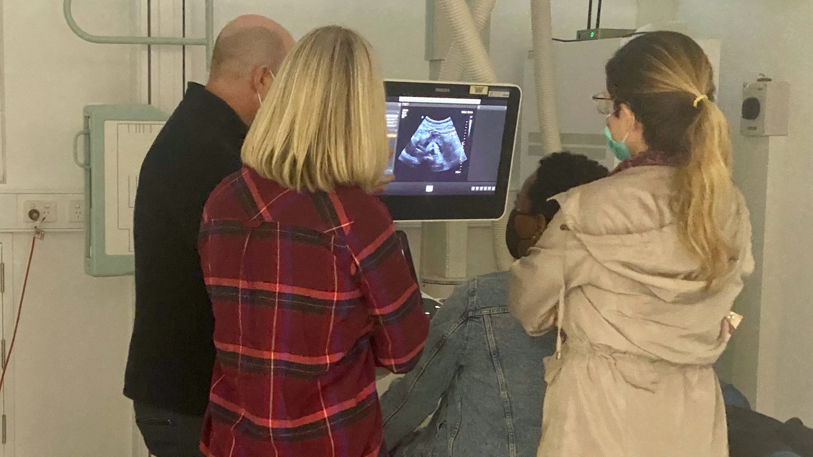

```{r setup, include=FALSE}
knitr::opts_chunk$set(echo = FALSE)
```

Sonography is unique in many respects. If we compare it to the other medical imaging modalities, we notice that it relies heavily on the operator's skill; for most other imaging modalities, the machine controls most of the elements that produce a satisfactory image. General Radiography still relies heavily on the ability of the Radiographer to position the patient correctly, but many of these positions are routine. Also, the skill to set exposure factors correctly is less dependent on the operator with the widespread use of computerised and digital radiography.


```{r, preview=TRUE}

```


On the other hand, sonography requires the operator's integrated skill to manipulate the transducer in various planes to produce a diagnostic image whilst adjusting controls that are not automatically adjusted by the machine. All the while simultaneously interpreting many images per second to determine if any significant pathology is present. The diagnostic ability of an ultrasound scan remains in real-time, and at the point of care, it is without a doubt that if a significant pathology is present and not imaged appropriately, it will not be detected in a review by a Radiologist, certainly when only static images are available. This combination of abilities highlights the high level of skills required of a Sonographer. 


Sonography is similar to other activities that require various skills to perform well, such as playing an instrument. Both a high level of coordination and the knowledge of music and how notes and sounds fit well together are required. Or like many sporting activities, which often require superior fitness but also require specific skills and knowledge of the game. Therefore, the training of a Sonographer takes many years. As student Sonographers, you are exposed to a range of training environments; at times, these are effective and provide ample opportunity to learn and develop. At other times learning can be complex due to factors outside our control.


This post aims to get you to think about ways that may help you accelerate this learning. Yes, there may be things outside your control, but what are some things that you can do to enhance your learning? Simply practising the skill is essential but will practice make perfect? and what does the research tell us about practice? Is merely doing thousands of hours of training ideal, and what about deliberate practice?


Some may be aware of the research, much of which has been popularised in several books, some of which are even best sellers. The book Outliers: The story of success by Malcolm Gladwell has several elements, but a vital tenet of the book is that one of the secrets to success is the notion of 10,000 hours of practice. Highlighting that a significant degree of time focused on a task is required to become truly an expert in any particular field, more so than any innate natural ability or genetic predisposition. Gladwell writes on many levels giving many examples, some personal and others from popular culture such as The Beatles and Bill Gates, and discussing the importance of environment and socio-economic factors being highly correlated to success.


So a significant amount of time is required, but for many of us, this is still something that may well be predetermined, such as how many days a week we work or are rostered in ultrasound, and some students do more than others. So is there anything else? Other authors have stated that there is truth to the 10,000 hours rule, but this is perhaps a little simplistic. Another interesting book is a book by Matthew Syed called Bounce.


Matthew Syed is a journalist who writes for the Times in the UK and lectures on many topics about success and high performance; interestingly, he became a world-class table tennis player, achieving fantastic success in this discipline. His book and others like it state that practice is essential, but also practice must be purposeful; otherwise, it is useless. At least some of the time, practice must force us out of our comfort zone to "overload" the current systems to cause improvements. Also, he stresses the importance of feedback as being necessary for progress. This helps us correct and fine-tune our abilities.


The above authors have likely drawn much of their influence from the work of Anders Ericsson, a professor of Psychology at Floria State University who has spent his life researching human performance. Importantly for us, much of his work has looked into the health care field, particularly the skill and expertise of doctors and nurses. His research and others in this field are interesting in relative expertise and skills as doctors progress in years. It has been shown that doctors (at least those more clinical and work in the diagnostic fields) get worse as time progresses. He explains this as a combination of factors, such as the inability to receive feedback on decisions made. Health care is complicated, and it is often difficult to define which intervention has been effective. In health, there is also the assumption that once you have finished your training and gained the knowledge, you are suitably skilled to perform at a high level. Anders argues that this is far from the truth and discusses the adage "see one, do one, teach one" and how this institutional thinking is damaging.


Health care workers, after a certain point in time, become comfortable with their abilities and, therefore, without knowing it, fail to progress further even if their knowledge advances. Anders argues that the key to the continued improvement of skills will only occur when a few critical components of learning and practice are adhered to. One crucial element for us is feedback; Anders in his book Peak uses the example that some particular doctors do improve over time but only when they can get direct feedback. He uses the example of surgeons that perform prostatectomies due to the presence of prostate cancer. For the surgery to be effective, the entire prostate has to be removed with histologically clear margins when the specimen is sent for analysis. Successful surgery directly impacts the patient's long-term survival rate, and the doctor will receive the results of their surgery a short time after they have performed it. It has become clear that those surgeons who have performed this operation many more times have much higher patient survival rates. Whereas those doctors who have to perform far fewer surgeries are almost always worse. The more experienced surgeons have practised more, gained feedback, and then adapted their technique to better outcomes.
This adaptation, in part, is a product of the learner developing some novel way to solve a complex issue. Anders describes this as "mental representations", and there is much to this described in his book, however, this youtube video explains it quite well
https://www.youtube.com/embed/uoUHlZP094Q


The core components mentioned in the video and the book are having specific, attainable goals, focusing on the problem at hand, gaining feedback and practising at least part of the time right at the limit of our abilities; added to this is having an effective coach, gives you the best chance to improve, and significantly to improve much quicker than simply spending time "just doing."


So how does any of this apply to Sonography? Well, that is what I want you to think about and provide some insights into what you think via the reply section on this page, and then hopefully start to implement these before we become too comfortable with our abilities.


